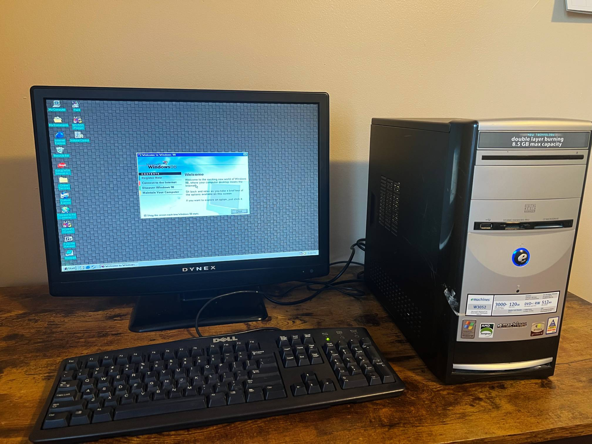
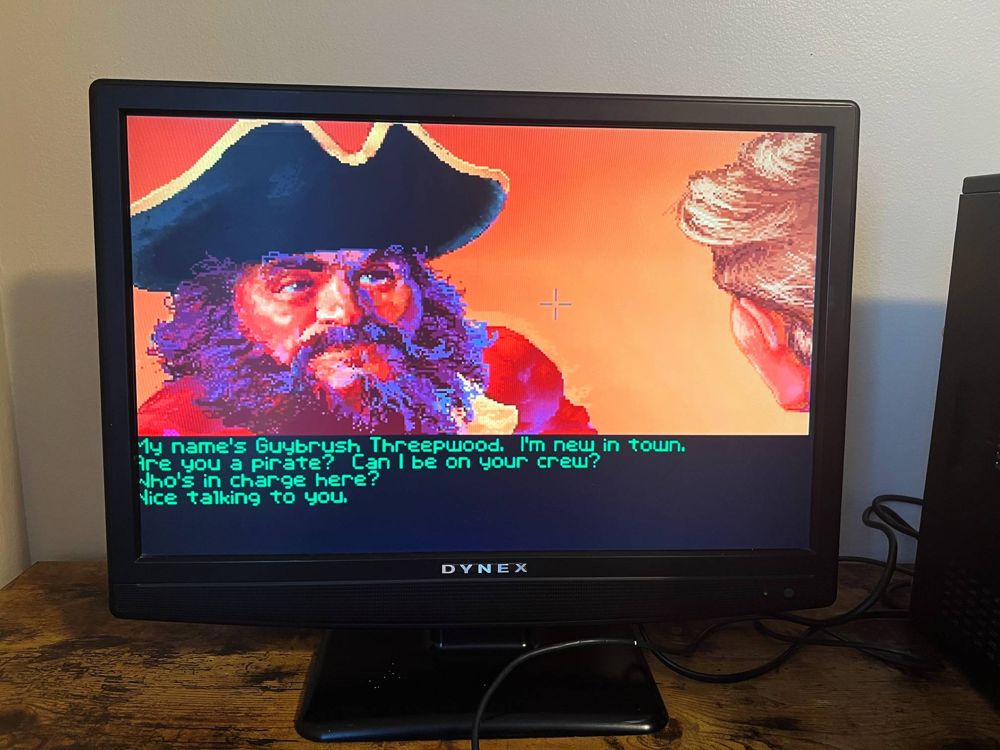

## Storytime

I was driving around town with my brother a few days ago.
We came across a garage sale that was closing up soon.
We hopped out and started browsing what was still out.
Among some nice t-shirts and trinkets, I found a dusty old Windows XP PC.
I like collecting old computers and consoles, reviving them, and then tucking them away in a closet lol.
So I picked this one up for the price of two Snickers bars.

Fooled by the Nvidia stickers on the PC, I decided to load up Deus Ex from 2000. It ran painfully slow.
After checking the hardware specs, it was obvious that anything 3D or made after Y2K will be a slideshow.
DOS-era games ran smoothly, but only if they were even able to start on Windows XP.
Windows XP was a departure from the previous iteration's DOS roots towards the modern NT kernel.
DOS games often have audio issues when running on Windows XP.

I kept the machine on Windows XP for a few days and listened to some MP3s on Winamp.
There's a certain magic to it.

I wanted to put Windows 98 SE on this machine, which is considered a good OS for enjoying DOS games.
The official way is probably installing using a CD, but the disk reader on this machine showed no signs of life.

## Instructions

Windows 98 does not support USB drives natively, but installing from one is possible using some FreeDOS tools and Rufus.

### What you'll need

Grab these things to prepare the USB drive:

- <a href="https://rufus.ie/" target="_blank" rel="noopener noreferrer">Rufus</a> to create a bootable, minimal FreeDOS environment
- `fdisk.exe`, `format.exe`, `sys.com`, and `xcopy.exe` from the FreeDOS ISO, or grab the binaries individually from the repos:
  - <a href="https://www.ibiblio.org/pub/micro/pc-stuff/freedos/files/repositories/unstable/pkg-html/fdisk.html" target="_blank" rel="noopener noreferrer">fdisk.zip</a>
  - <a href="https://www.ibiblio.org/pub/micro/pc-stuff/freedos/files/repositories/unstable/pkg-html/format.html" target="_blank" rel="noopener noreferrer">format.zip</a>
  - <a href="https://www.ibiblio.org/pub/micro/pc-stuff/freedos/files/repositories/unstable/pkg-html/kernel.html" target="_blank" rel="noopener noreferrer">kernel.zip</a>, which includes <code>sys.com</code>
  - <a href="https://www.ibiblio.org/pub/micro/pc-stuff/freedos/files/repositories/unstable/pkg-html/xcopy.html" target="_blank" rel="noopener noreferrer">xcopy.zip</a>
- Windows 98 setup files from an ISO

### Steps

1. Use the bundled FreeDOS option with Rufus to create a bootable USB drive.
2. Copy over the four FreeDOS tools and Windows 98 setup files to the USB drive.
3. Boot from the USB drive.
4. Use `fdisk.exe` to partition the internal HDD.
   - I created a single FAT32 partition for the C: drive.
5. Use `format.exe` with the `/s` flag to format the partition.
   - The `/s` flag uses `sys.com` to copy over `KERNEL` and `COMMAND` from FreeDOS. This ensures that we have a basic environment on the internal HDD to start the Windows 98 setup from.
6. Use `xcopy.exe` to copy Windows 98 installation files to the internal HDD.
7. Unplug the USB drive and reboot from the internal HDD.
8. Run setup.exe!!!
   - I used these flags: `setup /nm /is /ie /c /p j;a`. They bypass some hardware checks that often freeze the setup. See <a href="https://www.helpwithwindows.com/windows98/start-02.html" target="_blank" rel="noopener noreferrer">Setup Command-Line Switches</a>.
9.  *Optional:* Also install the NUSB driver from <a href="https://www.philscomputerlab.com/windows-98-usb-storage-driver.html" target="_blank" rel="noopener noreferrer">Phil's Computer Lab</a> for USB drive support after Windows 98 is installed.

That should be it.

---

## More yapping

Check out this glorious pixel art from The Secret of Monkey Island:

Also, I had no speaker plugged in, but this game still plays <a href="https://www.youtube.com/watch?v=1IOL4q5tDDQ" target="_blank" rel="noopener noreferrer">some nice chiptunes</a> using the basic beeper on the motherboard.
Some peak 90s gamedev wizardry. 
